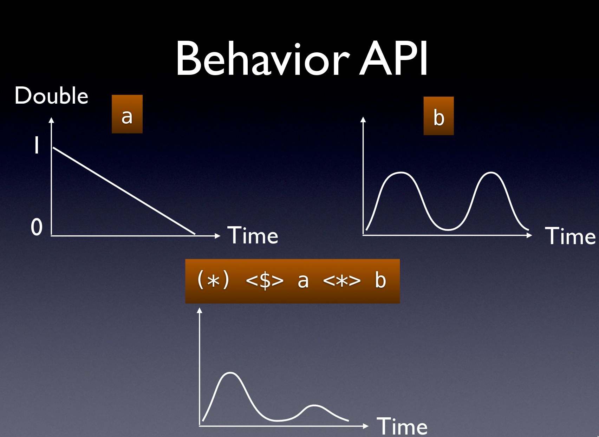
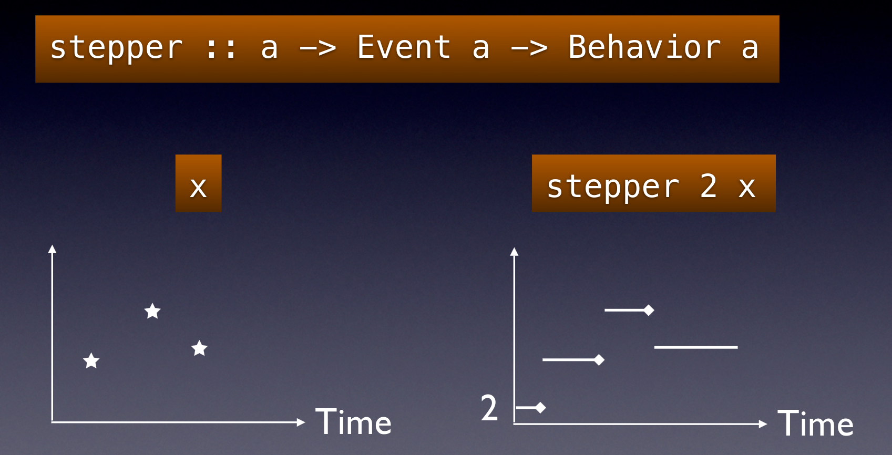
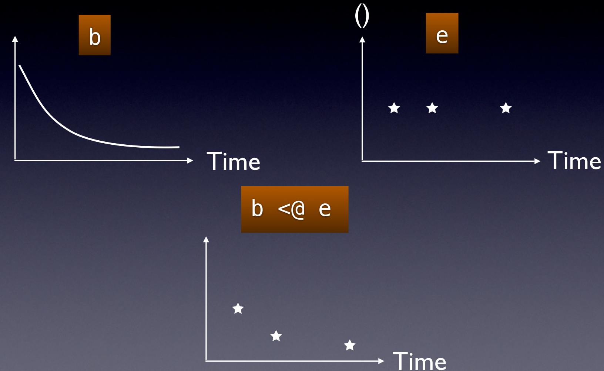

# Functional Reactive Programming

```haskell
{-# LANGUAGE ImportQualifiedPost #-}
{-# LANGUAGE TypeApplications #-}

module L17_FRP where

import Reactive.Banana
import Reactive.Banana.Frameworks
import Reactive.Banana.Model qualified as Model
```

Functional Reactive Programming (FRP) integrates time flow and compositional
events into functional programming. It offers an elegant and concise way to
express interactive programs such as graphical user interfaces, animations,
computer music or robot controllers. In particular, it promises to avoid the
spaghetti code that is all too common in traditional approaches
to GUI programming.

In this lecture, we're going to study FRP from library `reactive-banana`.
Its goal is to provide a solid foundation.

* Programmers interested in implementing FRP will have a reference for simple
  semantics with a working implementation. The library stays close to the
  semantics [pioneered](http://conal.net/papers/icfp97/) by Conal Elliott.
* The library features an efficient implementation. No more spooky time leaks,
  predicting space & time usage should be straightforward.
* A plethora of
  [example code](https://wiki.haskell.org/Reactive-banana#documentation)
  helps with getting started.

The library is meant to be used in conjunction with existing libraries that are
specific to your problem domain. For instance, you can hook it into any
event-based GUI framework, like `wxHaskell` or `Gtk2Hs`. Several helper packages
like `reactive-banana-wx` provide a small amount of glue code that can make life
easier.

[Feedback](https://wiki.haskell.org/Reactive-banana#feedback)
is welcome, author wants to hear from you!

## Fake Testimonials

> In the programming-language world, one rule of survival is simple:
> dance or die. This library makes dancing easy.
> <p align="right">&mdash; Simon Banana Jones</p>

> About the use of language: it is impossible to sharpen a pencil with a blunt
> axe. You should try `reactive-banana` instead.
> <p align="right">&mdash; Event Dijkstra</p>

> When I need a bullet event, I can just trigger it.
> <p align="right">&mdash; Billy the Reactive Banana</p>

> This should be in a museum!
> <p align="right">&mdash; Banana Jones</p>

> Hey Mister! Why not use `reactive-banana` as a smartphone app
> to brush your teeth?
> <p align="right">&mdash; Tommy "Banana" Johnson</p>

## `Event` and `Behavior`

Core idea: _variation in time as a first-class value_. It is captured with two
datatypes: `Behavior a` and `Event a`.

* Behavior corresponds to "a value that varies in time".
* Event corresponds to "events that occurr at certain points in time".

Model implementation is the following
(of course, the real implementation is more efficient):

```haskell
data Time -- abstract
type ModelBehavior a = Time -> a
type ModelEvent a    = [(Time, a)]
```

Note that, for `Event`, it is assumed that:

* list of events is potentially infinite;
* no two events in a stream happen at the same time;
* events are provided in time-increasing order.

Here's a little example graph to explain the difference:

```
Event stream:    -----*-------*---*-------*--->
                  (click)   (key) (click) (timer)

Behavior:        ────────┬────────┬───────────>
                  5       7        9         (value at each time)
```

## `Behavior` API

API for behaviors is actually very simple: they are just applicative functors.

```haskell
mapBehavior :: (a -> b) -> Behavior a -> Behavior b
mapBehavior = fmap

pureBehavior :: a -> Behavior a
pureBehavior = pure

applyBehavior :: Behavior (a -> b) -> Behavior a -> Behavior b
applyBehavior = (<*>)
```

Example task for `<*>`: attenuate an oscillation.



## `Event` API

API for events is a bit more elaborate, but is closely related to operations on
lists.

```haskell
mapEvent :: (a -> b) -> Event a -> Event b
mapEvent = fmap

neverEvent :: Event a
neverEvent = never

unionWithEvent :: (a -> a -> a) -> Event a -> Event a -> Event a
unionWithEvent = unionWith

filterEvent :: (a -> Bool) -> Event a -> Event a
filterEvent = filterE

accumEvent :: MonadMoment m => a -> Event (a -> a) -> m (Event a)
accumEvent = accumE
```

## Interactions between events and behaviors

Of course, the most interesting part about the API concerns the interaction
between Behavior and Event. The `stepper` function turns an `Event` into a
`Behavior` by remembering the value.
The result is a step function, hence the name.



**Important:** Behavior changes happen *slightly after* the event occurrence,
enabling recursion.

But wait, there are more:

```haskell
applyEvent :: Behavior (a -> b) -> Event a -> Event b
applyEvent = (<@>)

tag :: Behavior b -> Event a -> Event b
tag = (<@)
```



## Framework integration

The API discussed so far allows you to combine existing Events and Behaviors
into new ones, but it doesn‘t tell you how to get them in the first place.
For this, you have to bind to external frameworks. The following functions are
available:

```haskell
newAddHandler' :: IO (AddHandler a, a -> IO ())
-- ^ first component is a handle used by `reactive-banana` to recognize an
-- event, while the second one is the trigger that fires new event.
newAddHandler' = newAddHandler

fromAddHandler' :: AddHandler a -> MomentIO (Event a)
-- ^ Registers a handle for an external event inside a network.
-- `MomentIO` is a "builder monad" for network which is required for some of
-- the combinators.
fromAddHandler' = fromAddHandler
```

## Moment Monad

To enable higher-order reactive programming and preserve sharing between
time-varying values, there's a notion of "FRP network" in `reactive-banana`.
They are constructed within the `Moment` monad:

```haskell ignore
newtype Moment a = M { unM :: Time -> a }
instance Monad Moment
instance MonadFix Moment
```

Usually, defining and running an FRP network is managed like this:

```haskell
buildNetwork :: IO ()
buildNetwork = do
  (addHandler, fire) <- newAddHandler           -- create input handlers
  network <- compile $ do                       -- build network description
    eInput <- fromAddHandler addHandler         -- convert inputs to Events
    eCounter <- accumE 0 ((+1) <$ eInput)       -- define FRP logic
    reactimate $ print @Integer <$> eCounter    -- connect to external world
  actuate network                               -- start the network
  fire "hello"                                  -- feed inputs
```

## Model-based testing

The `Model` module provides an authoritative interpreter:

```haskell
interpretModel ::
  (Model.Event a -> Model.Moment (Model.Event b)) -> [Maybe a] -> [Maybe b]
interpretModel = Model.interpret
```

This allows pure testing of FRP logic without `IO`. Here's a primitive example:

```haskell
testCounter :: Bool
testCounter =
    let events = [Just 1, Just 2, Nothing, Just 3] :: [Maybe Integer]
        result = Model.interpret (\e -> Model.accumE 0 (const <$> e)) events
    in result == [Just 0, Just 1, Just 2, Just 2]
```

## Performance considerations

### Push vs. pull

Reactive-banana uses an efficient **push-driven** implementation for production:
- Events are propagated immediately when they occur
- Behaviors are evaluated only when needed
- No polling overhead

### Optimization tips

1. Use `filterJust` before complex transformations
2. Prefer `accumB` over `stepper` with `fmap` when possible
3. Avoid unnecessary `switch`es (higher-order combinators have overhead)
4. Profile with `-finfo-table-map` for debugging

## Summary and best practices

### When (and when not) to use FRP

Ideal use cases:
* GUI applications with complex interdependent widgets
* Real-time data processing (sensors, network streams)
* Interactive animations and games
* Home automation and control systems

Consider alternatives for:
* Simple linear workflows (use `pipes` or `conduit`)
* Purely synchronous computation
* Resource-constrained environments (FRP has overhead)

### Design principles

1. Describe _relationships_ between time-varying values
2. Avoid imperative escapes: keep IO in `reactimate` blocks only
3. Use `interpret` for unit tests
4. Leverage higher-order FRP for dynamic networks when needed

The beauty of reactive-banana lies in its **principled design** &mdash; once you
understand the semantics, you can reason about complex reactive systems with
mathematical certainty.

## References

- [`reactive-banana` on Haskell Wiki](https://wiki.haskell.org/Reactive-banana)
- [Conal Elliott's FRP-related publications](http://conal.net/papers/frp.html)
